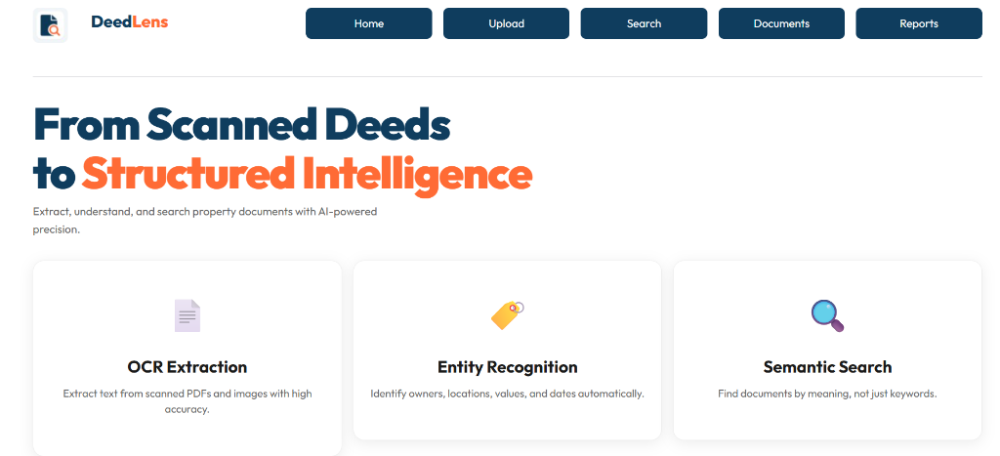
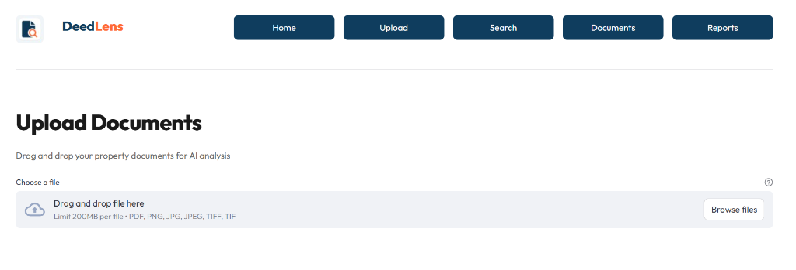
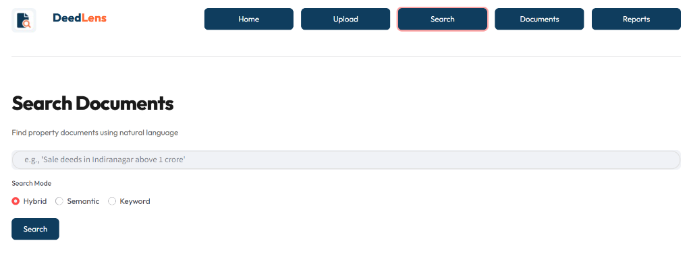

# DeedLens: AI-Powered Property Document Intelligence

DeedLens is a sophisticated document analysis platform designed to transform unstructured property deeds into structured, searchable intelligence. It leverages advanced OCR, Named Entity Recognition (NER), and Semantic Search to provide deep insights into legal property documents.


## 🚀 Features

*   **📄 High-Fidelity OCR**: Utilizes Groq Vision (Llama-4-Scout) to accurately extract text from scanned, noisy, or handwritten property deeds.
*   **🏷️ Named Entity Recognition (NER)**: Automatically identifies and categorizes key information such as:
    *   **Parties**: Buyers, Sellers, Witnesses
    *   **Property Details**: Survey Numbers, Khasra/Khatoni Numbers, Area
    *   **Financials**: Transaction Value, Market Value
    *   **Dates**: Execution Date, Registration Date
*   **🔍 Semantic Search**: Goes beyond keyword matching. Search for "Sale deeds in Indiranagar above 1 crore" and get contextually relevant results using FAISS vector embeddings.
*   **📊 Document Intelligence**: Classification of document types (Sale Deed, Power of Attorney, Will, etc.) optimized for Indian legal contexts.
*   **� Modern UI**: A Vercel-inspired, responsive Streamlit interface with a "Typography First" design system.

## 🛠️ Tech Stack

*   **Frontend**: Streamlit
*   **OCR**: Groq API (Llama-4-Scout / Llama-3.2-Vision)
*   **NLP & Embeddings**: SentenceTransformers (`all-MiniLM-L6-v2`), Spacy
*   **Vector Store**: FAISS
*   **Backend Logic**: Python, Pandas, Regex
*   **Data Handling**: PyMuPDF (Fitz), PIL

## 📸 Screenshots

### 1. Home Dashboard
The command center for your document intelligence. Quickly access upload, search, and reporting tools.


### 2. Document Upload
Drag-and-drop interface for processing PDF or Image files. Real-time processing pipeline visualization.


### 3. Semantic Search
Natural language query interface to find specific deeds based on meaning, entities, or financial criteria.


## ⚡ Getting Started

### Prerequisites

*   Python 3.9+
*   Groq API Key (for OCR)

### Installation

1.  **Clone the repository**
    ```bash
    git clone https://github.com/yourusername/deedlens.git
    cd deedlens
    ```

2.  **Install dependencies**
    ```bash
    pip install -r requirements.txt
    ```

3.  **Configure Environment**
    Create a `.env` file in the root directory:
    ```env
    GROQ_API_KEY=your_groq_api_key_here
    OCR_BACKEND=groq
    ```

4.  **Run the Application**
    ```bash
    streamlit run app.py
    ```

## 📂 Project Structure

```
deedlens/
├── app.py                 # Main Streamlit Application
├── assets/                # Images, Icons, and Screenshots
├── data/                  # Raw and Processed Data storage
├── nlp/                   # NER Models and Entity Resolution
├── ocr/                   # OCR Engine Interfaces (Groq, Tesseract)
├── search/                # Vector Search and Indexing Logic
└── requirements.txt       # Project Dependencies
```

## 🤝 Contributing

Contributions are welcome! Please feel free to submit a Pull Request.

---
*DeedLens - Clarity for your Property Documents.*
