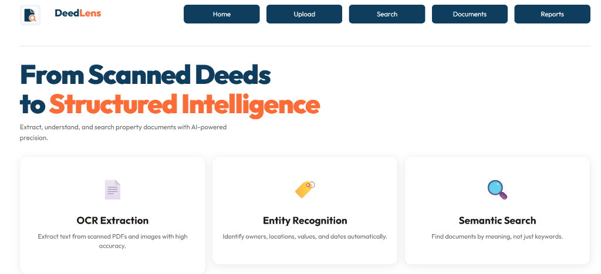
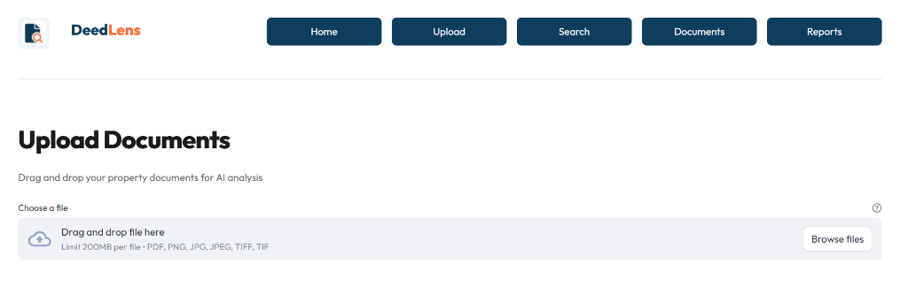
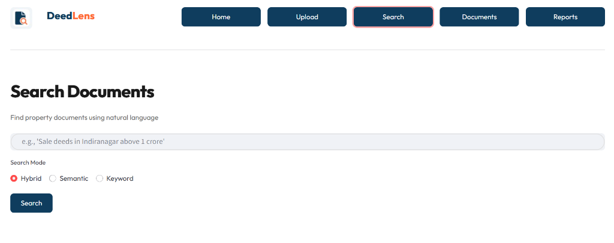

# DeedLens: Asynchronous Document Processing System

> **Production-grade document processing pipeline with ML-powered extraction and hybrid search.**

DeedLens is a backend system that transforms unstructured property documents into structured, searchable data. Built with proper engineering: async job queues, observability metrics, BM25+vector hybrid search, and PostgreSQL persistence.



---

## 🏗️ System Architecture

```
┌─────────────────────────────────────────────────────────────────┐
│                         CLIENT LAYER                            │
├─────────────┬─────────────────────────────────────────────────┤
│  Streamlit  │              FastAPI REST                        │
│     UI      │   /upload  /search  /jobs  /metrics              │
└──────┬──────┴──────────────────┬──────────────────────────────┘
       │                         │
       ▼                         ▼
┌─────────────────────────────────────────────────────────────────┐
│                       JOB QUEUE (Redis)                         │
│  ┌─────────┐  ┌─────────┐  ┌─────────┐  ┌─────────┐            │
│  │ Priority│  │ Default │  │  Batch  │  │  Dead   │            │
│  │  Queue  │  │  Queue  │  │  Queue  │  │ Letter  │            │
│  └─────────┘  └─────────┘  └─────────┘  └─────────┘            │
└──────────────────────────┬──────────────────────────────────────┘
                           │
                           ▼
┌─────────────────────────────────────────────────────────────────┐
│                    PROCESSING PIPELINE (Celery)                 │
│                                                                 │
│   ┌─────┐    ┌─────┐    ┌─────┐    ┌─────┐    ┌─────┐         │
│   │ OCR │───▶│Clean│───▶│ NER │───▶│Embed│───▶│Store│         │
│   └─────┘    └─────┘    └─────┘    └─────┘    └─────┘         │
│      │          │          │          │          │             │
│      └──────────┴──────────┴──────────┴──────────┘             │
│                           │                                     │
│                    processing_logs                              │
│                   (observability)                               │
└──────────────────────────┬──────────────────────────────────────┘
                           │
                           ▼
┌─────────────────────────────────────────────────────────────────┐
│                     DATA LAYER                                  │
├──────────────────┬──────────────────┬───────────────────────────┤
│    PostgreSQL    │   FAISS Index    │      File Storage        │
│  ┌────────────┐  │  ┌────────────┐  │  ┌────────────────────┐  │
│  │ documents  │  │  │  vectors   │  │  │  data/uploads/     │  │
│  │ entities   │  │  │  (384-dim) │  │  │  data/index/       │  │
│  │ jobs       │  │  └────────────┘  │  └────────────────────┘  │
│  │ proc_logs  │  │                  │                          │
│  └────────────┘  │                  │                          │
└──────────────────┴──────────────────┴───────────────────────────┘
```

---

## 🎯 Key Engineering Features

### ⚡ Async Processing Pipeline
Not just "Celery is there" — properly engineered:

```python
# Chained tasks with per-stage observability
pipeline = chain(
    ocr_task.s(job_id),      # Stage 1: Extract text
    clean_task.s(),           # Stage 2: OCR corrections
    ner_task.s(),             # Stage 3: Entity extraction
    embed_task.s(),           # Stage 4: Vector embeddings
    store_task.s()            # Stage 5: Persist to DB
)
```

- **Exponential backoff retries** (`retry_backoff=True`)
- **Per-stage metrics** logged to `processing_logs`
- **Priority queues** (urgent vs batch)
- **Partial failure recovery**

### 📊 Observability (The Killer Feature)

Every stage logs metrics:

```
GET /metrics
{
  "time_window": "24h",
  "total_processed": 156,
  "overall_success_rate": 97.4,
  "throughput_per_hour": 6.5,
  "bottleneck_stage": "ocr",
  "stages": [
    {"stage": "ocr", "avg_duration_ms": 2340, "p95_duration_ms": 4500, "failure_rate": 1.2},
    {"stage": "ner", "avg_duration_ms": 890, "p95_duration_ms": 1200, "failure_rate": 0.5},
    ...
  ]
}
```

### 🔍 Engineered Hybrid Search

Not "vector + keyword = hybrid" — proper scoring formula:

```
score = (0.6 × vector_score) + (0.3 × bm25_score) + (0.1 × recency_boost)
```

- **BM25** (same as Elasticsearch) for keyword matching
- **Sentence transformers** for semantic similarity  
- **Query parsing** extracts filters automatically
- **Result explanation** shows scoring breakdown

```
Query: "sale deeds in Bangalore above 50 lakhs"
→ Filters: {location: "Bangalore", price_min: 5000000, doc_type: "sale_deed"}
→ Search: remaining terms with hybrid scoring
```

### 🗄️ PostgreSQL Schema Design

Properly normalized with indexes:

| Table | Purpose |
|-------|---------|
| `documents` | Core storage + JSONB metadata |
| `entities` | Normalized entity extraction |
| `jobs` | Job lifecycle with audit trail |
| `processing_logs` | Per-stage metrics (observability!) |
| `search_metadata` | Denormalized search index |

---

## 🤔 Why Not Just Use ChatGPT/Claude?

Great question! Here's why DeedLens exists:

| | **ChatGPT/Claude** | **DeedLens** |
|---|---|---|
| **🔒 Privacy** | Your sensitive property documents go to OpenAI/Anthropic servers | **100% local** — your data never leaves your machine |
| **💾 Memory** | Forgets everything after each session | **Persistent storage** — upload once, search forever |
| **🔍 Search** | Can't search across multiple documents | **Semantic search** across your entire document library |
| **📜 Old Documents** | Struggles with scanned/handwritten deeds | **Multi-backend OCR** optimized for noisy, old documents |
| **🏷️ Domain Knowledge** | Generic AI, no property context | **Fine-tuned NER** for Survey Numbers, Khasra, Boundaries, etc. |
| **📦 Batch Processing** | One document at a time | Process **entire folders** at once |
| **💰 Cost** | $20+/month subscription | **Free**, runs on your laptop |
| **🌐 Internet** | Requires constant connection | Works **completely offline** (with EasyOCR/Tesseract) |

### Real-World Use Cases

1. **Land Dispute Research**: "Find all sale deeds mentioning Survey No. 45/2 in Indiranagar" — instantly searches across 500+ documents
2. **Due Diligence**: Upload 50 property documents, extract all parties and transaction values in minutes
3. **Privacy-Sensitive Work**: Analyze client documents without uploading to third-party AI services
4. **Rural/Offline Work**: Process documents at remote land offices with no internet

---

## 🚀 Features

### 📄 Multi-Backend OCR
Choose the OCR engine that fits your needs:

| Backend | Privacy | Speed | Quality | Best For |
|---------|---------|-------|---------|----------|
| **EasyOCR** | ✅ 100% Local | Medium | Good | Privacy-first, offline work |
| **Tesseract** | ✅ 100% Local | Fast | Good | Speed-critical processing |
| **Groq Vision** | ❌ Cloud API | Fastest | Best | Maximum accuracy (uses Llama-4-Scout) |

### 🏷️ Named Entity Recognition (NER)
Automatically identifies and categorizes:
- **Parties**: Buyers, Sellers, Witnesses, Donors, Donees
- **Property Details**: Survey Numbers, Khasra/Khatoni Numbers, Patta Numbers, Plot Numbers
- **Location**: State, District, Taluk, Village, Landmarks
- **Financials**: Transaction Value, Market Value, Stamp Duty
- **Dates**: Execution Date, Registration Date
- **Document Type**: Sale Deed, Gift Deed, Power of Attorney, Will, Lease, etc.

### 🔍 Semantic Search
Goes beyond keyword matching. Ask natural questions like:
- "Sale deeds in Koramangala above 1 crore"
- "Gift deeds from father to daughter"
- "Properties near MG Road registered in 2024"

Powered by FAISS vector embeddings with `all-MiniLM-L6-v2`.

### 🧹 Smart OCR Post-Processing
Automatic correction of 50+ common OCR errors:

| Error Type | Example |
|------------|---------|
| **Indian States** | "Kamataka" → "Karnataka", "Tamii Nadu" → "Tamil Nadu" |
| **Cities** | "Bangal ore" → "Bangalore", "Chenna1" → "Chennai" |
| **Localities** | "Koramanga1a" → "Koramangala", "lndiranagar" → "Indiranagar" |
| **Numbers** | "1Oth" → "10th", "2Oth" → "20th" |
| **Currency** | "rs," → "Rs.", normalizes lakh/crore formatting |

### 💾 Persistent Storage
- **PostgreSQL** with proper schema design
- JSONB for flexible metadata
- Document embeddings stored in FAISS for fast semantic search
- Survives restarts — upload once, search forever

### 🔐 Secure API
- FastAPI backend with OpenAPI documentation
- Optional API key authentication
- CORS configuration for web frontends

---

## 🛠️ Tech Stack

| Component | Technology |
|-----------|------------|
| **Frontend** | Streamlit |
| **Backend API** | FastAPI |
| **Database** | PostgreSQL 16 |
| **Job Queue** | Celery + Redis |
| **OCR** | EasyOCR, Tesseract, Groq Vision |
| **NLP** | SpaCy (`en_core_web_sm`) |
| **Embeddings** | SentenceTransformers (`all-MiniLM-L6-v2`) |
| **Vector Store** | FAISS |
| **Search** | BM25 + Vector Hybrid |
| **Containerization** | Docker, docker-compose |

---

## 📸 Screenshots

### 1. Home Dashboard
The command center for your document intelligence.


### 2. Document Upload & Processing
Drag-and-drop interface with real-time OCR and NER extraction.


### 3. Semantic Search
Natural language search across all your documents.


---

## ⚡ Getting Started

### Prerequisites

- **Python 3.9+** (tested on 3.11, 3.13)
- **Docker Desktop** (recommended for full deployment)
- 4GB RAM minimum (8GB recommended for EasyOCR)

### Option 1: Docker (Recommended)

```bash
# Clone the repository
git clone https://github.com/yourusername/deedlens.git
cd deedlens

# Build and start all services
docker-compose up -d

# Open in browser
# http://localhost:8501
```

### Option 2: Local Development

```bash
# 1. Clone the repository
git clone https://github.com/yourusername/deedlens.git
cd deedlens

# 2. Create virtual environment
python -m venv venv
source venv/bin/activate  # Windows: venv\Scripts\activate

# 3. Install dependencies
pip install -r requirements.txt
python -m spacy download en_core_web_sm

# 4. Configure environment
cp .env.example .env
# Edit .env: set OCR_BACKEND=easyocr for privacy

# 5. Run the application
streamlit run app.py
```

Open http://localhost:8501 in your browser.

### OCR Backend Configuration

Edit `.env` to choose your OCR backend:

```bash
# For 100% local/private processing (recommended)
OCR_BACKEND=easyocr

# For speed (requires Tesseract installed)
OCR_BACKEND=tesseract

# For best quality (requires internet + API key)
OCR_BACKEND=groq
GROQ_API_KEY=your_key_here
```

### Installing Tesseract (Optional)

**Windows:** Download from [UB-Mannheim](https://github.com/UB-Mannheim/tesseract/wiki)

**macOS:** `brew install tesseract`

**Linux:** `sudo apt install tesseract-ocr`

---

## 🐳 Docker Deployment (Recommended)

The easiest way to run DeedLens with all features (including async processing):

```bash
# Build all images (first time or after code changes)
docker-compose build

# Start all services
docker-compose up -d

# Verify all containers are running
docker-compose ps
```

**Services started:**
| Service | URL | Description |
|---------|-----|-------------|
| **PostgreSQL** | localhost:5432 | Primary database |
| **Redis** | localhost:6379 | Job queue broker |
| **Streamlit UI** | http://localhost:8501 | Main web interface |
| **FastAPI** | http://localhost:8000/docs | API documentation |
| **Celery Worker** | (background) | Async document processing |

```bash
# View logs (all services)
docker-compose logs -f

# View specific service logs
docker-compose logs -f worker
docker-compose logs -f streamlit

# Stop all services
docker-compose down

# Stop and remove volumes (clean slate)
docker-compose down -v
```

### Docker Resource Requirements

| Resource | Minimum | Recommended |
|----------|---------|-------------|
| **RAM** | 4GB | 8GB |
| **Disk** | 5GB | 10GB |
| **CPU** | 2 cores | 4 cores |

> **Note**: First build downloads ~2GB of ML models (PyTorch, SpaCy, SentenceTransformers).

### Running Locally (Without Docker)

For development or when you don't need async processing:

```bash
# 1. Clone and setup
git clone https://github.com/yourusername/deedlens.git
cd deedlens
python -m venv venv
source venv/bin/activate  # Windows: venv\Scripts\activate

# 2. Install dependencies
pip install -r requirements.txt
python -m spacy download en_core_web_sm

# 3. Configure environment
cp .env.example .env
# Edit .env: set OCR_BACKEND=easyocr for privacy

# 4. Run Streamlit only (sync processing)
streamlit run app.py
```

### Running Async Processing Locally

To enable async processing without full Docker setup:

```bash
# Terminal 1: Start Redis
docker run -d -p 6379:6379 --name deedlens-redis redis:7-alpine

# Terminal 2: Start Celery worker
celery -A worker.celery_app worker --loglevel=info --pool=solo

# Terminal 3: Start API server
uvicorn api.app:app --host 0.0.0.0 --port 8000 --reload

# Terminal 4: Start Streamlit
streamlit run app.py
```

Set in your `.env`:
```bash
REDIS_URL=redis://localhost:6379/0
```

## 🔧 Environment Variables

Create a `.env` file in the project root:

```bash
# OCR Backend (easyocr, tesseract, or groq)
OCR_BACKEND=easyocr

# For Groq Vision API (optional - cloud OCR)
GROQ_API_KEY=your_api_key_here

# Redis URL (for async processing)
REDIS_URL=redis://localhost:6379/0

# API Security (optional)
API_KEY=your_secret_key

# Logging
LOG_LEVEL=INFO

# Database
DATABASE_PATH=data/deedlens.db
```

---

## 📂 Project Structure

```
deedlens/
├── app.py                 # Streamlit UI
├── config.py              # Pydantic Settings configuration
├── api/
│   └── app.py             # FastAPI REST API
├── core/
│   ├── database.py        # SQLite + FTS5 persistence
│   ├── jobs.py            # Job lifecycle management
│   ├── logger.py          # Colored logging
│   └── service.py         # DocumentService (unified pipeline)
├── worker/
│   ├── celery_app.py      # Celery configuration
│   └── tasks.py           # Chained pipeline tasks (5 stages)
├── nlp/
│   ├── ner_model.py       # Named Entity Recognition
│   ├── embeddings.py      # Sentence embeddings
│   └── entity_resolution.py
├── ocr/
│   └── ocr_engine.py      # Multi-backend OCR
├── preprocessing/
│   └── text_cleaner.py    # OCR post-processing (50+ corrections)
├── search/
│   ├── search_engine.py   # BM25 + Vector hybrid search
│   └── vector_index.py    # FAISS index management
├── analytics/
│   └── __init__.py        # Metrics utilities
├── tests/                 # Pytest test suite
├── data/
│   ├── uploads/           # Uploaded documents
│   └── index/             # FAISS index files
├── Dockerfile
├── docker-compose.yml
└── requirements.txt
```

---

## 🔌 API Endpoints

### Documents

| Method | Endpoint | Description |
|--------|----------|-------------|
| `GET` | `/health` | Health check |
| `GET` | `/stats` | System statistics |
| `POST` | `/upload` | Upload and process document (sync) |
| `GET` | `/documents` | List all documents |
| `GET` | `/documents/{id}` | Get document by ID |
| `DELETE` | `/documents/{id}` | Delete document |
| `POST` | `/search` | Search documents |

### Jobs (Async Processing)

| Method | Endpoint | Description |
|--------|----------|-------------|
| `POST` | `/jobs/upload` | Upload for async processing |
| `GET` | `/jobs/{id}` | Get job status + progress |
| `GET` | `/jobs` | List all jobs |
| `GET` | `/jobs/metrics/summary` | Job queue metrics |
| `DELETE` | `/jobs/{id}` | Cancel job |

### Observability (THE KILLER FEATURE)

| Method | Endpoint | Description |
|--------|----------|-------------|
| `GET` | `/metrics` | Per-stage latency, throughput, failure rates |
| `GET` | `/metrics/daily` | Daily throughput trends |
| `GET` | `/metrics/stage/{name}` | Detailed stage metrics + errors |

### Example: Upload Document

```bash
curl -X POST "http://localhost:8000/upload" \
  -H "X-API-Key: your_api_key" \
  -F "file=@deed.pdf"
```

### Example: Async Upload

```bash
# Upload for async processing
curl -X POST "http://localhost:8000/jobs/upload" \
  -F "file=@deed.pdf"

# Response: {"job_id": "abc-123", "status": "pending"}

# Poll for status
curl "http://localhost:8000/jobs/abc-123"
# Response: {"status": "completed", "progress": 100, "document_id": "xyz-789"}
```

### Example: Search Documents

```bash
curl -X POST "http://localhost:8000/search" \
  -H "Content-Type: application/json" \
  -d '{"query": "sale deed in Bangalore above 50 lakhs", "mode": "hybrid"}'
```

---

## 🧪 Running Tests

```bash
# Run all tests
pytest tests/ -v

# Run specific test file
pytest tests/test_text_cleaner.py -v

# Run with coverage
pytest tests/ --cov=. --cov-report=html
```

### Testing Docker Deployment

```bash
# Health check
curl http://localhost:8000/health

# Get system stats
curl http://localhost:8000/stats

# Upload a document (sync)
curl -X POST http://localhost:8000/upload -F "file=@sample.pdf"

# Upload a document (async)
curl -X POST http://localhost:8000/jobs/upload -F "file=@sample.pdf"

# Get job status
curl http://localhost:8000/jobs/{job_id}

# Get processing metrics (THE KILLER FEATURE)
curl http://localhost:8000/metrics

# Get metrics for specific stage
curl http://localhost:8000/metrics/stage/ocr

# Search with explanation
curl -X POST http://localhost:8000/search \
  -H "Content-Type: application/json" \
  -d '{"query": "sale deeds in Bangalore above 50 lakhs", "explain": true}'
```

---

## 🗺️ Roadmap

### ✅ Completed (v2.0)
- [x] Multi-backend OCR (EasyOCR, Tesseract, Groq Vision)
- [x] Named Entity Recognition for Indian property documents
- [x] BM25 + Vector hybrid search with configurable weights
- [x] Query parsing with automatic filter extraction
- [x] Indian OCR post-processing (50+ corrections)
- [x] **PostgreSQL** with proper schema design
- [x] FastAPI REST endpoints
- [x] Streamlit web UI
- [x] Async job queue (Redis + Celery)
- [x] **Chained pipeline** (5 stages with `chain()`)
- [x] **Exponential backoff retries**
- [x] **Per-stage observability** (`/metrics` endpoint)
- [x] Docker deployment with docker-compose
- [x] Priority queues (urgent vs batch)

### 📋 Planned
- [ ] WebSocket real-time job updates
- [ ] Batch folder upload
- [ ] PDF text layer extraction (skip OCR when possible)
- [ ] Export to Excel/CSV
- [ ] Multi-language OCR (Hindi, Tamil, Kannada)
- [ ] Document comparison tool
- [ ] Cloud deployment guide (Railway, Render)
- [ ] Kubernetes deployment manifests
- [ ] S3/MinIO document storage

---

## 💡 System Design (Interview Ready)

**Q: How do you scale workers?**
> Add more Celery workers. Redis distributes tasks automatically. Each worker processes jobs independently.

**Q: What happens if Redis crashes?**
> Jobs are persisted in PostgreSQL with status tracking. On recovery, pending jobs can be replayed from the `jobs` table.

**Q: How do you handle partial failures?**
> Each stage logs to `processing_logs` with status. Jobs track `error_stage` and `error_message`. Can resume from last successful stage.

**Q: How would you handle 1M documents?**
> - Shard FAISS index by date/region
> - Add PostgreSQL read replicas  
> - Horizontal scale Celery workers
> - Consider Elasticsearch for search at scale

**Q: What's your search scoring formula?**
> `score = (0.6 × vector) + (0.3 × bm25) + (0.1 × recency)` — configurable via `SearchConfig`.

---

## 🤝 Contributing

Contributions are welcome! Areas where help is needed:

1. **OCR Corrections**: Add more Indian place name corrections to `preprocessing/text_cleaner.py`
2. **NER Patterns**: Improve entity extraction in `nlp/ner_model.py`
3. **Tests**: Expand test coverage
4. **Documentation**: Add more examples and guides

---

## 📄 License

MIT License — free for personal and commercial use.

---

<p align="center">
<strong>DeedLens</strong> — Clarity for your Property Documents.<br>
<em>Built for privacy. Designed for professionals. Free forever.</em>
</p>

---

## 🙏 Acknowledgments

- [EasyOCR](https://github.com/JaidedAI/EasyOCR) for local OCR
- [SpaCy](https://spacy.io/) for NLP
- [FAISS](https://github.com/facebookresearch/faiss) for vector search
- [Streamlit](https://streamlit.io/) for the beautiful UI
- [FastAPI](https://fastapi.tiangolo.com/) for the API
